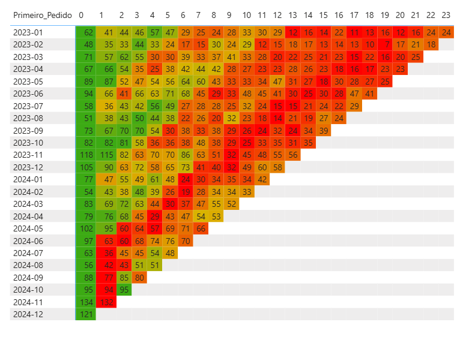
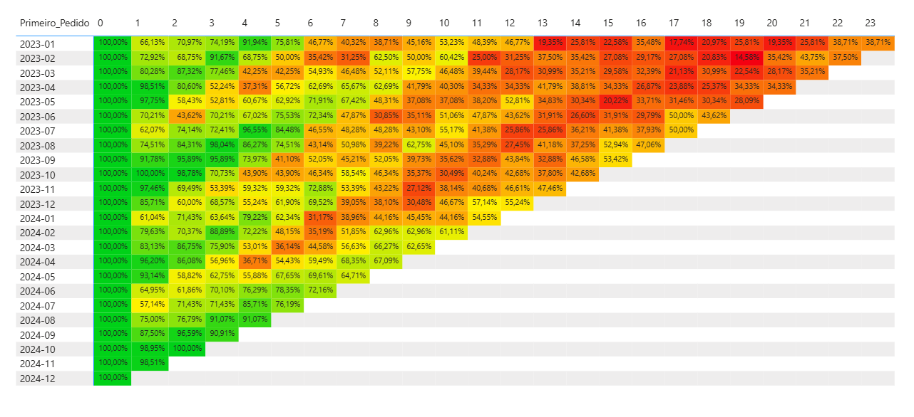

# Análise de Cohort no Power BI

Uma análise de retenção de clientes que construí para aprofundar meus conhecimentos em DAX e expandir meu portfólio.




---

## O que é Análise de Cohort?

A Análise de Cohort é uma técnica que agrupa clientes com base em uma característica comum, geralmente a data da primeira compra.

Diferente de métricas que mostram apenas uma "foto" do momento, o cohort permite acompanhar o comportamento de grupos específicos ao longo do tempo. Com isso, conseguimos enxergar padrões de retenção, engajamento e ciclo de vida do cliente.

### Por que usar?

- **Identificar tendências de retenção** — os clientes estão voltando ou abandonando?
- **Comparar períodos** — campanhas ou mudanças no produto impactaram a retenção?
- **Prever receita futura** — com base no comportamento histórico dos cohorts
- **Segmentar ações** — direcionar estratégias específicas para grupos com baixa retenção

### Um exemplo simples

Imagine que você abriu uma loja. Em janeiro chegaram 62 clientes novos. 

A pergunta é: quantos desses 62 voltaram em fevereiro? E em março? E depois?

É exatamente isso que o cohort responde. Ele agrupa clientes pelo mês da primeira compra e acompanha o retorno deles ao longo do tempo.

---

## Sobre este Projeto

Pensando em evoluir e expandir meu portfólio, mergulhei no estudo de Análise de Cohort, assisti vídeos, li artigos e coloquei a mão na massa no Power BI.

O objetivo foi construir uma análise completa de retenção, partindo de uma base fictícia e aplicando DAX para criar toda a estrutura do zero.

### O que eu construí

- **Matriz de Clientes no Cohort** — quantidade absoluta de clientes que retornaram em cada período
- **Matriz de % Retenção** — proporção de clientes que retornaram em relação ao total do cohort
- **Formatação condicional por linha** — gradiente de cores normalizado para facilitar a leitura
- **Tabela de parâmetros** — permite alternar entre as visualizações de forma dinâmica

### Como ler a matriz

- Cada **linha** representa um grupo de clientes que fez a primeira compra no mesmo mês
- Cada **coluna** representa "quantos meses depois"
- O **número** mostra quantos clientes voltaram naquele período
- As **cores** facilitam a leitura: verde = boa retenção, vermelho = baixa retenção

**Na prática:** linha 2023-01, coluna 3 → dos 62 clientes que entraram em janeiro, 57 voltaram a comprar 3 meses depois.

### Leitura dos Dados

> ⚠️ **Nota:** Os dados são fictícios e gerados via IA, então os padrões não refletem comportamentos reais de mercado.

Para demonstrar como interpretar a matriz:

- **Coluna 0** — sempre mostra 100%, é o mês de entrada do cohort
- **Queda inicial** — os primeiros meses após a entrada tendem a ter maior variação
- **Estabilização** — cohorts mais antigos permitem ver se há estabilização da retenção

Em dados reais, seria interessante analisar:

- Sazonalidade (Black Friday, Natal, férias)
- Impacto de campanhas de reativação
- Comparação entre canais de aquisição

---

## Os Dados

Para este projeto, gerei uma base fictícia de vendas usando o Claude.

| Info | Descrição |
|------|-----------|
| Período | 2023 - 2024 |
| Registros | 29.082 linhas |
| Colunas | 18 campos |

<details>
<summary><strong>Ver estrutura completa da base</strong></summary>

| Coluna | Tipo | Descrição |
|--------|------|-----------|
| ID_Pedido | int | Identificador do pedido |
| ID_Item | int | Item dentro do pedido |
| DT_Pedido | datetime | Data do pedido |
| ID_Cliente | int | Identificador do cliente |
| DS_Segmento | texto | Segmento do cliente |
| DS_Regiao | texto | Região |
| DS_Estado | texto | Estado |
| DS_Canal_Aquisicao | texto | Canal de aquisição |
| DS_Canal_Venda | texto | Canal de venda |
| ID_Produto | int | Identificador do produto |
| DS_Categoria | texto | Categoria do produto |
| QTD | int | Quantidade |
| VL_Unitario | decimal | Valor unitário |
| VL_Desconto | decimal | Valor do desconto |
| VL_Custo_Unitario | decimal | Custo unitário |
| VL_Frete | decimal | Frete |
| DS_Forma_Pagamento | texto | Forma de pagamento |
| DS_Status | texto | Status do pedido |

</details>

---

## Como foi Construído

Aqui está todo o passo a passo da construção no Power BI.

### 1. Colunas Calculadas

Primeiro, criei uma coluna para identificar o mês do primeiro pedido de cada cliente:

```dax
Data_Primeiro_Pedido = 
VAR cliente = Vendas[ID_Cliente]
RETURN
CALCULATE(
    EOMONTH(MIN(Vendas[DT_Pedido]), 0),
    FILTER(Vendas, Vendas[ID_Cliente] = cliente)
)
```

E uma coluna formatada para exibir na matriz:

```dax
Primeiro_Pedido = FORMAT(Vendas[Data_Primeiro_Pedido], "yyyy-mm")
```

### 2. Tabela de Parâmetro

Criei uma tabela auxiliar para representar os meses após o cohort (as colunas da matriz):

```dax
Meses Após Cohort = 
GENERATESERIES(0, DISTINCTCOUNT(Calendario[Fim_mes_pedido]))
```

### 3. Medidas Principais

**Qtd Clientes** — base para todas as contagens:

```dax
Qtd Clientes = DISTINCTCOUNT(Vendas[ID_Cliente])
```

**Clientes no Cohort** — conta quantos clientes do cohort compraram X meses depois:

```dax
Clientes no Cohort = 
VAR meses_apos = SELECTEDVALUE('Meses Após cohort'[Value])
VAR primeiro_pedido = SELECTEDVALUE(Vendas[Primeiro_Pedido])
RETURN
CALCULATE(
    [Qtd Clientes],
    FILTER(
        Vendas,
        EOMONTH(Vendas[DT_Pedido], 0) = EOMONTH(primeiro_pedido, meses_apos)
    )
)
```

**% Retenção** — calcula a proporção de clientes que retornaram:

```dax
% Retenção Clientes no Cohort = 
VAR meses_apos = SELECTEDVALUE('Meses Após cohort'[Value])
VAR primeiro_pedido = SELECTEDVALUE(Vendas[Primeiro_Pedido])
VAR clientes_cohort = 
    CALCULATE(
        [Qtd Clientes],
        FILTER(
            Vendas,
            EOMONTH(Vendas[DT_Pedido], 0) = EOMONTH(primeiro_pedido, meses_apos)
        )
    )
RETURN
DIVIDE(clientes_cohort, [Qtd Clientes])
```

### 4. Formatação Condicional

Para o gradiente de cores funcionar por linha (e não pela matriz inteira), criei medidas de normalização:

**Para a matriz de clientes:**

```dax
Normalização Clientes = 
VAR valor_min = MINX(ALL('Meses Após Cohort'[Value]), [Clientes no Cohort])
VAR valor_max = MAXX(ALL('Meses Após Cohort'[Value]), [Clientes no Cohort])
RETURN
DIVIDE(
    [Clientes no Cohort] - valor_min,
    valor_max - valor_min,
    1
)
```

**Para a matriz de retenção:**

```dax
Normalização Retenção = 
VAR valor_min = MINX(ALL('Meses Após Cohort'[Value]), [% Retenção Clientes no Cohort])
VAR valor_max = MAXX(ALL('Meses Após Cohort'[Value]), [% Retenção Clientes no Cohort])
RETURN
DIVIDE(
    [% Retenção Clientes no Cohort] - valor_min,
    valor_max - valor_min,
    1
)
```

---

## Estrutura da Matriz

| Elemento | Campo |
|----------|-------|
| Linhas | Primeiro_Pedido |
| Colunas | Meses Após Cohort[Value] |
| Valores | Clientes no Cohort ou % Retenção |
| Formatação | Gradiente via medidas de normalização |

---

## Outras Possibilidades

Nesta análise usei quantidade de clientes e % de retenção, mas a mesma estrutura serve para:

- **Ticket médio** — quanto gastam ao longo do tempo?
- **Receita acumulada** — qual o valor gerado por cohort?
- **Frequência de compra** — quantos pedidos fizeram no período?

A lógica muda pouco, o insight muda muito.

---

## Arquivos do Repositório

```
├── assets/
│   ├── matriz_clientes.png
│   └── matriz_retencao.png
├── data/
│   └── vendas_2023_2024_v2.xlsx
└── pbix/
    └── analise_cohort.pbix
```

---

## Autor

**Gabriel Souza** — Data & BI Analyst

Estou sempre buscando evoluir e aprender novas técnicas de análise. Se tiver sugestões ou quiser trocar uma ideia, fique à vontade para me chamar!
